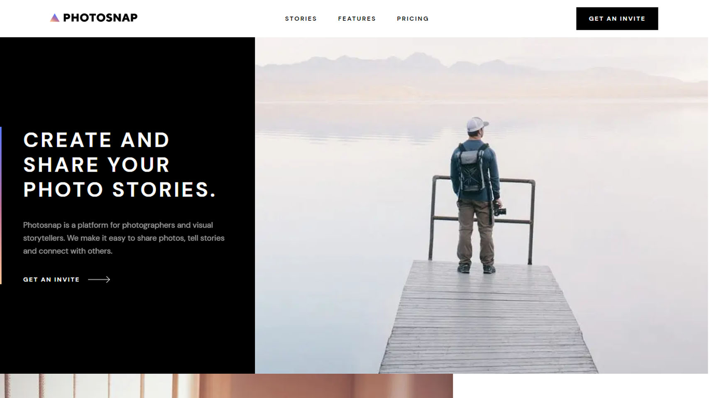
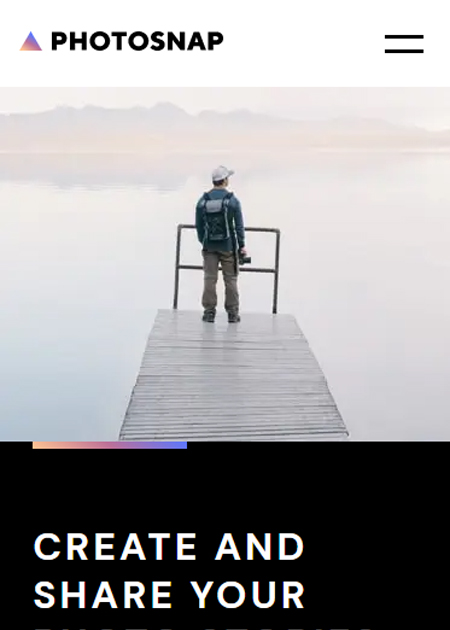

# Photosnap Website Info

## Table of contents

- [Overview](#overview)
  - [The challenge](#the-challenge)
  - [Screenshot](#screenshot)
  - [Links](#links)
- [My process](#my-process)
  - [Built with](#built-with)
  - [What I learned](#what-i-learned)
- [Author](#author)

## Overview

### The challenge

Users should be able to:

- View the optimal layout for each page depending on their device's screen size
- See hover states for all interactive elements throughout the site

### Screenshot

### Links

- Live Site URL: [Photosnap Website Demo](https://photosnap-app-demo.netlify.app/)

## My process

### Built with

- Semantic HTML5 markup
- CSS Modules
- Flexbox
- CSS Grid
- Mobile-first workflow
- [React](https://reactjs.org/) - JS library
- [Next.js](https://nextjs.org/) - React framework
- [Zustand](https://zustand-demo.pmnd.rs/) - For State Management

### What I learned

I used this project to work with Next,js and to further my experience with TypeScript. The site uses Next.js built in Routing system to change pages, and is fully responsive to whatever device you are using.

## Author

- Website - [Logan Ricard](https://www.logvnjs.dev)
- Frontend Mentor - [@LogvnR](https://www.frontendmentor.io/profile/LogvnR)
- LinkedIn - [LogvnR](https://www.linkedin.com/in/logvnr/)
